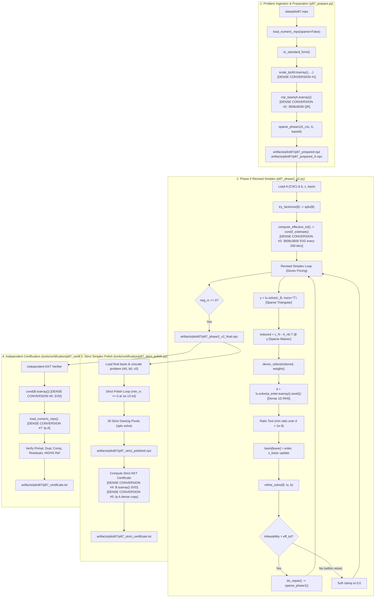
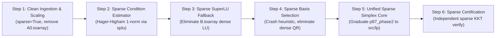

# Audit Report: Existing Crossover -> Simplex/Polish -> Certification Pipeline

**Target:** SIH 26119 — Sovereign Optimization Solver  
**Focus:** Sparse-to-Dense Boundaries, Scalability Bottlenecks, and Migration Roadmap for End-to-End Sparse Crossover  
**Benchmark Case Study:** `PILOT87` ($m_{\text{orig}} = 2030, n_{\text{orig}} = 4883 \to m_{\text{std}} = 3608, n_{\text{std}} = 8038$)  
**Status:** Pre-implementation Audit (Zero source modifications, zero test modifications, zero commits)

---

## Executive Summary

The Sovereign Optimization Solver has validated and committed:
1. The **sparse Mehrotra predictor-corrector IPM pipeline** (`src/lp/mehrotra.py`, `src/scaling.py`, `src/numerical_model.py`).
2. The **`MMD_AT_PLUS_A` SuperLU ordering optimization** for the Schur complement factorization ($S = A H^{-1} A^T$) in `src/lp/linear_system.py`.

On the challenging Netlib benchmark `PILOT87`, standalone Mehrotra IPM enters a numerical tail around iteration 36 due to extreme dynamic range in $H = \text{diag}(z/x)$ ($h_{\max}/h_{\min} > 10^{16}$) and reports `stalled`. The repository overcomes this limitation not through the raw IPM iterate alone, but through an independent **crossover $\to$ simplex $\to$ strict polish $\to$ certification pipeline**. This pipeline drives the solution to a strictly certified optimum matching HiGHS to within $1.1 \times 10^{-10}$ in objective value.

However, an end-to-end architectural audit reveals that **the existing crossover pipeline is a hybrid of sparse algorithms punctuated by massive, avoidable densification bottlenecks**. While the core Phase-I repair and Phase-II Revised Simplex iterations utilize sparse SuperLU factorizations (`splu`) and sparse matrix-vector products, several critical steps convert the entire constraint matrix or basis matrix into dense NumPy 2D arrays (`A.toarray()`, `B.toarray()`), triggering dense LAPACK QR decompositions (`dgeqp3`) and dense SVDs (`dgesdd`).

### The Three Fundamental Tiers of Linear Algebra in Crossover

To prevent misconceptions, this audit strictly distinguishes:
1. **Input Sparsity:** Preservation of the problem topology ($A$, $b$, $c$, bounds, row types) from MPS ingestion through standard-form transformation and scaling without ever materializing an $m \times n$ dense grid.
2. **Sparse Basis & Factorization:** Maintaining the active basis matrix $B = A[:, \text{basis}]$ as a sparse matrix (CSC format) and computing factorizations ($P B Q = L U$) where $L$ and $U$ are sparse factors with low fill-in, solved via sparse triangular back-substitution.
3. **Dense Numerical Factors & 1D Vectors:** Solution iterates ($x$, $x_B$, $y$, $z$), directions ($d = B^{-1} a_j$), right-hand sides, and reduced costs ($r = c_N - A_N^T y$) are **mathematically dense 1D vectors**. Keeping them as dense 1D NumPy arrays ($O(m)$ or $O(n)$ elements, occupying under $100\text{ KB}$) is standard, cache-optimal, and does not compromise scalability. In contrast, allocating dense 2D matrices ($O(m \times n)$ or $O(m^2)$, occupying hundreds of megabytes) destroys large-scale scalability.

---

## A. Actual Call Graph

The repository contains two distinct families of crossover implementations:
1. **Exploratory / Research Drivers** (`solver.py`, `stage2_repair.py`, `run_pilot87_crossover.py`, `sparse_crossover_ipm.py`), which tested naive $|x|/|z|$ ranking, dense composite Phase-I repair, and dense wrappers around `src/lp/simplex.py`.
2. **The Actual Validated PILOT87 Production Pipeline** (`tools/run_pilot87_verified.py`), which orchestrates the four validated stages that produced the certified result in `artifacts/pilot87/`.

---

## B. Current PILOT87 Crossover Path (Step-by-Step Execution Trace)

The actual verified solution for `PILOT87` executed via `tools/run_pilot87_verified.py` traces through four scripts:

### 1. Preparation Stage (`experiment/crossover/p87_prepare.py`)
* **Input:** `data/pilot87.mps` ($m=2030, n=4883, \text{nnz}=73152$).
* **Parsing & Standardization:**
  - Calls `load_numeric_mps("data/pilot87.mps")`. Because `sparse=False` by default, this creates a dense NumPy array for $A$ ($2030 \times 4883$).
  - Calls `to_standard_form(lp)`. Because `lp.A` is dense, `to_standard_form` executes its dense code paths, creating a dense standard-form matrix $A_{\text{std}}$ of size $3608 \times 8038$ (absorbing 1578 box upper-bound rows and slack variables).
  - Converts $A_{\text{std}}$ to `scipy.sparse.csc_matrix`.
* **Scaling:**
  - Calls `scale_lp(A0.toarray(), b0, c0, ...)`. Here `A0.toarray()` **explicitly converts the matrix back to a dense $3608 \times 8038$ array (232 MB)**, despite `scale_lp` natively supporting sparse CSR input!
* **Basis Selection (RRQR):**
  - Calls `rrqr_basis(A.toarray())` in `stage1_audit_rrqr.py`.
  - Executes `scipy.linalg.qr(A_dense, pivoting=True, mode="economic")` on the dense $3608 \times 8038$ matrix.
  - Takes 76 seconds of CPU time and generates 3608 permutation indices `basis0 = piv[:3608]`.
* **Phase-I Feasibility Repair:**
  - Calls `sparse_phase1(A, b, basis0)`.
  - Normalizes rows with negative RHS ($b_i < 0$).
  - Augments the problem with $m=3608$ artificial variables: $A_{\text{aug}} = [A \mid I] \in \mathbb{R}^{3608 \times 11646}$ (sparse CSC).
  - Initializes basis to all artificials ($B = I$, guaranteed feasible and well-conditioned).
  - Runs sparse simplex iterations: refactors $B$ using SuperLU (`splu`), solves $x_B = B^{-1} b$, dual $y = B^{-T} c_B$, computes reduced costs $d = c_N - A_N^T y$ via sparse matvec, and pivots out artificials.
  - Reaches feasible original basis in ~389 seconds.
* **Artifact Persistence:**
  - Saves $A$ as `artifacts/pilot87/p87_prepared_A.npz` (sparse CSC) and problem vectors/basis as `p87_prepared.npz`.

### 2. Phase II Revised Simplex (`experiment/crossover/p87_phase2_v2.py`)
* **Input:** `p87_prepared_A.npz` and `p87_prepared.npz`.
* **Initialization:**
  - Builds initial basis $B = A[:, \text{basis}]$.
  - Factorizes via `try_factorize(B)` $\to$ `splu(B)`.
  - Solves $x_B = B^{-1} b$ with iterative refinement (`refine_solve`).
  - Initializes Devex pricing weights: solves $B d_j = a_j$ for 150 nonbasic columns to establish initial column scales.
* **Per-Pivot Loop:**
  - **Condition-aware gate:** Computes effective feasibility tolerance $\text{eff\_tol} = \kappa(B) \cdot \epsilon_{\text{mach}} \cdot \|b\|_\infty \cdot 50$. To compute $\kappa(B)$, `compute_effective_tol` calls `cond2_estimate(B)` $\to$ **calls `B.toarray()` and runs `np.linalg.cond` (dense SVD of $3608 \times 3608$, 104 MB) every 200 iterations!**
  - **Dual solve:** $y = B^{-T} c_B$ using `lu.solve(c_basic, trans='T')`.
  - **Pricing:** $r = c_N - A_N^T y$ using sparse CSC transpose matvec (`A_nb.T @ y`).
  - **Variable Selection:** `devex_select(reduced, nonbasic, devex_weights)` selects entering column $q$.
  - **Direction Solve:** $d = B^{-1} a_q$ via `lu.solve(a_enter.toarray().ravel())`. (1D dense vector of length 3608).
  - **Ratio Test:** Min-ratio test with Bland tie-breaking on tied minimum ratios.
  - **Basis Update & Refactorization:** Updates basis index `basis[lidx] = q`. Re-extracts $B = A[:, \text{basis}]$ and calls `try_factorize(B)` $\to$ `splu(B)` (per-pivot refactorization required for numerical stability on PILOT87).
  - **Iterative Refinement:** `refine_solve(B, lu, b)` performs up to 5 iterative refinement steps to suppress LU accumulation error.
  - **Soft Clamping:** If basic variables drift negative but remain within `eff_tol`, they are clamped to 0.0, avoiding objective destruction from full Phase-I restarts.
* **Termination:** Reaches optimal basis (zero negative reduced costs within $10^{-7}$) and saves `p87_phase2_v2_final.npz`.

### 3. Strict Reduced-Cost Polish (`tools/certification/p87_strict_polish.py`)
* **Input:** `p87_phase2_v2_final.npz` and unscaled problem reconstruction.
* **Execution:**
  - Unscales the problem using persisted row/column scales: $A_0 = R^{-1} A_{\text{sc}} C^{-1}$, $b_0 = R^{-1} b_{\text{sc}}$, $c_0 = C^{-1} c_{\text{sc}}$.
  - Continues Revised Simplex pivoting using strict raw reduced costs (tolerance $10^{-13}$ instead of $10^{-7}$).
  - Executes exactly **30 strict pivots**, eliminating every marginal negative reduced cost down to numerical zero ($\ge -1.4 \times 10^{-14}$).
  - Saves `p87_strict_polished.npz`.
* **Verification:**
  - Reconstructs original LP: calls `load_numeric_mps("data/pilot87.mps")` (dense!).
  - Computes `A_orig = np.asarray(lp.A, float)` (dense $2030 \times 4883$, 79.3 MB).
  - Checks condition number via `np.linalg.cond(B.toarray())` (dense SVD of $3608 \times 3608$).
  - Emits stdout captured into `artifacts/pilot87/p87_strict_certificate.txt`.

### 4. Independent KKT Certification (`tools/certification/p87_certify.py`)
* **Input:** `p87_prepared.npz`, `p87_prepared_A.npz`, `p87_phase2_v2_final.npz`.
* **Independent Auditing:**
  - Does **not** trust solver objectives or internal flags.
  - Verifies primal feasibility $\|A x - b\|_\infty \le 1.6 \times 10^{-11}$.
  - Verifies basis residual $\|B x_B - b\|_\infty \le 1.6 \times 10^{-11}$.
  - Verifies complementarity $x^T z \approx -3.7 \times 10^{-13}$.
  - Recomputes condition number using dense SVD: `np.linalg.cond(B.toarray())`.
  - Re-parses original MPS as dense and computes independent original objective $c_{\text{orig}}^T x_{\text{orig}} = 301.710347333$, matching HiGHS reference within $1.1 \times 10^{-10}$.
  - Writes verified certificate to `artifacts/pilot87/p87_certificate.txt`.

---

## C. Dense-Boundary Inventory

The following table itemizes every function involved across the crossover, simplex, polish, and certification modules, recording the 10 specific audit criteria.

| File | Function | Caller | Input Matrix Type | Sparse Accepted? | Sparse Converted to Dense? | np.asarray / toarray / np.linalg ops | Matrix Dims (PILOT87) | Object Scale | Frequency |
| :--- | :--- | :--- | :--- | :--- | :--- | :--- | :--- | :--- | :--- |
| `src/numerical_model.py` | `load_numeric_mps` | `p87_prepare.py`, `p87_strict_polish.py`, `p87_certify.py` | Parsed MPS dict | Yes (via `sparse=True`) | **YES** (by default `sparse=False`) | `np.zeros((m, n))` | $2030 \times 4883$ | **HUGE (79.3 MB)** | Once per solve |
| `src/numerical_model.py` | `to_numeric` | `load_numeric_mps(sparse=False)` | `LPModel` | No | Creates dense directly | `np.zeros((m, n))` | $2030 \times 4883$ | **HUGE (79.3 MB)** | Once per solve |
| `src/numerical_model.py` | `to_sparse_numeric` | `load_numeric_mps(sparse=True)` | `LPModel` | Yes | **NO** (builds CSR directly from COO tuples) | None on 2D matrix | $2030 \times 4883$ | Small (886 KB CSR) | Once per solve |
| `src/lp/mehrotra.py` | `to_standard_form` | `p87_prepare.py`, `p87_strict_polish.py` | `NumericalLP.A` (dense or sparse) | Yes | **NO** (preserves sparse if input is sparse) | `np.linalg.matrix_rank` (skipped if sparse) | $3608 \times 8038$ | Huge if dense input (232 MB), small if sparse (1.2 MB) | Once per solve |
| `src/scaling.py` | `scale_lp` | `p87_prepare.py` | `np.ndarray` or `sp.spmatrix` | Yes | **NO** (native sparse CSR path exists) | None if sparse | $3608 \times 8038$ | Small (CSR in-place data scaling) | Once per solve |
| `experiment/crossover/p87_prepare.py` | `main` | `tools/run_pilot87_verified.py` | `NumericalLP` | N/A | **YES** (`A0.toarray()` passed to `scale_lp`) | `A0.toarray()`, `A.toarray()` | $3608 \times 8038$ | **HUGE (232 MB)** | Once per solve |
| `experiment/crossover/stage1_audit_rrqr.py` | `rrqr_basis` | `p87_prepare.py` | `np.ndarray` | **NO** | **YES** (requires dense array) | `scipy.linalg.qr(..., pivoting=True)` | $3608 \times 8038$ | **HUGE (232 MB input + 104 MB R + workspace)** | Once per solve |
| `experiment/crossover/stage1_audit_rrqr.py` | `measure_basis` | `stage1_audit_rrqr.py` | `np.ndarray` | No | Yes | `np.linalg.svd(B)`, `np.linalg.cond(B, 1)`, `sla.lu_factor(B)` | $3608 \times 3608$ | **HUGE (104 MB B + SVD factors)** | Diagnostic only |
| `experiment/crossover/sparse_phase1.py` | `sparse_phase1` | `p87_prepare.py`, `p87_phase2_v2.py:do_repair` | `sp.spmatrix` (CSC) | Yes | **NO** (main loop is sparse) | `aq.toarray().ravel()` (single column) | $3608 \times 11646$ ($A_{\text{aug}}$) | Local (1D vector, 28.8 KB) | Repeated per Phase-I pivot |
| `experiment/crossover/sparse_phase1.py` | Basis factorize | `sparse_phase1` | `sp.csc_matrix` ($B$) | Yes | **NO** | `scipy.sparse.linalg.splu(B)` | $3608 \times 3608$ | Small (SuperLU sparse factors) | Every pivot |
| `experiment/crossover/sparse_phase1.py` | Basis solves | `sparse_phase1` | SuperLU object | Yes | **NO** | `lu.solve(b)`, `lu.solve(cB, trans="T")` | Length 3608 | Local (1D vectors, 28.8 KB) | 2 per pivot |
| `experiment/crossover/sparse_phase1.py` | Direction solve | `sparse_phase1` | SuperLU object | Yes | **NO** | `lu.solve(aq.toarray().ravel())` | Length 3608 | Local (1D vector, 28.8 KB) | 1 per candidate |
| `experiment/crossover/p87_phase2_v2.py` | `try_factorize` | `p87_phase2_v2.py` | `sp.csc_matrix` ($B$) | Yes | **CONDITIONAL** (fallback densifies) | `splu(B)`; fallback: `B.toarray()`, `sla.lu_factor` | $3608 \times 3608$ | Small in SuperLU; Huge if fallback (104 MB) | Every pivot |
| `experiment/crossover/p87_phase2_v2.py` | `refine_solve` | `p87_phase2_v2.py` | SuperLU object | Yes | **NO** | `lu.solve(rhs)`, `lu.solve(resid)` | Length 3608 | Local (1D vectors, 28.8 KB) | 1-5 per pivot |
| `experiment/crossover/p87_phase2_v2.py` | `cond2_estimate` | `compute_effective_tol` | `sp.csc_matrix` ($B$) | Yes | **YES** | `B.toarray()`, `np.linalg.cond(...)` | $3608 \times 3608$ | **HUGE (104 MB + SVD workspace)** | **Repeated (every 200 iters)** |
| `experiment/crossover/p87_phase2_v2.py` | `compute_effective_tol` | `p87_phase2_v2.py` | `sp.csc_matrix` ($B$) | Yes | **YES** (calls `cond2_estimate`) | Calls `cond2_estimate` | $3608 \times 3608$ | **HUGE (104 MB)** | **Repeated (every 200 iters)** |
| `experiment/crossover/p87_phase2_v2.py` | `devex_init_weights` | `p87_phase2_v2.py` | `sp.csc_matrix` ($A$), SuperLU | Yes | **NO** | `lu.solve(a_col.toarray().ravel())` | Length 3608 | Local (1D vector, 28.8 KB) | Once (150 solves) |
| `experiment/crossover/p87_phase2_v2.py` | Dual solve & pricing | `p87_phase2_v2.py` | SuperLU, `sp.csc_matrix` | Yes | **NO** | `lu.solve(c_basic, trans='T')`, `A_nb.T @ y` | Length 3608, 4430 | Local (1D vectors, ~35 KB) | Every pivot |
| `experiment/crossover/p87_phase2_v2.py` | Column direction solve | `p87_phase2_v2.py` | SuperLU object | Yes | **NO** | `lu.solve(a_enter.toarray().ravel())` | Length 3608 | Local (1D vector, 28.8 KB) | Every pivot |
| `tools/certification/p87_strict_polish.py` | Polish pivot loop | `p87_strict_polish.py` | `sp.csc_matrix` ($B$) | Yes | **NO** | `splu(B)`, `lu.solve(...)`, `A_nb.T @ y` | $3608 \times 3608$ | Small (SuperLU factors) | Every polish pivot (30 iters) |
| `tools/certification/p87_strict_polish.py` | Certificate eval | `p87_strict_polish.py` | `sp.csc_matrix`, `NumericalLP` | Partial | **YES** | `np.linalg.cond(B.toarray())`, `np.asarray(lp.A, float)` | $3608 \times 3608$, $2030 \times 4883$ | **HUGE (104 MB + 79.3 MB)** | Once (at certificate time) |
| `tools/certification/p87_certify.py` | Certificate verification | `p87_certify.py` | `sp.csc_matrix`, `NumericalLP` | Partial | **YES** | `np.linalg.cond(B.toarray())`, `np.asarray(lp.A, float)` | $3608 \times 3608$, $2030 \times 4883$ | **HUGE (104 MB + 79.3 MB)** | Once (at certificate time) |
| `src/lp/simplex.py` | `_solve_basis` | `simplex.py` | `np.ndarray` ($B$) | **NO** | **YES** (100% dense) | `np.linalg.cond(B)`, `np.linalg.solve(B, rhs)` | $m \times m$ | **HUGE (Dense SVD + LU)** | Every simplex pivot |
| `src/lp/simplex.py` | `_simplex_iterations` | `simplex.py` | `np.ndarray` ($A, B$) | **NO** | **YES** (100% dense) | `A[:, basis]`, `_solve_basis`, dense matvecs | $m \times n$ | **HUGE (Dense tableau & B)** | Every simplex pivot |

---

## D. Memory Implications & PILOT87 Scalability Estimates

### 1. The Scale of PILOT87
* **Original LP:** $m = 2030$ constraints, $n = 4883$ variables, $\text{nnz} = 73,152$ ($0.74\%$ density).
* **Standard-Form LP:** $m = 3608$ equality rows (2030 original + 1578 box upper-bound rows), $n = 8038$ columns (block columns + slacks), $\text{nnz} = 77,204$ ($0.27\%$ density).
* **Square Basis Matrix ($B$):** $3608 \times 3608$, $\text{nnz} \approx 35,000 - 45,000$ ($0.27 - 0.35\%$ density).

### 2. Memory Footprint: Sparse vs. Dense Formulations

| Representation | Data Structure | Formula / Composition | PILOT87 Memory |
| :--- | :--- | :--- | :--- |
| **Sparse Original $A$** | `scipy.sparse.csr_matrix` | $73,152 \times 8\text{B} + 73,152 \times 4\text{B} + 2,031 \times 4\text{B}$ | **0.89 MB** |
| **Dense Original $A$** | `numpy.ndarray` (float64) | $2030 \times 4883 \times 8\text{B}$ | **79.30 MB** (89x blowup) |
| **Sparse Standard-Form $A_{\text{std}}$** | `scipy.sparse.csc_matrix` | $77,204 \times 8\text{B} + 77,204 \times 4\text{B} + 8,039 \times 4\text{B}$ | **0.96 MB** |
| **Dense Standard-Form $A_{\text{std}}$** | `numpy.ndarray` (float64) | $3608 \times 8038 \times 8\text{B}$ | **232.00 MB** (241x blowup) |
| **Sparse Basis $B$** | `scipy.sparse.csc_matrix` | $\approx 40,000 \times 8\text{B} + 40,000 \times 4\text{B} + 3,609 \times 4\text{B}$ | **0.49 MB** |
| **Dense Basis $B$** | `numpy.ndarray` (float64) | $3608 \times 3608 \times 8\text{B}$ | **104.14 MB** (212x blowup) |
| **SuperLU Factors ($L + U$)** | `scipy.sparse.linalg.SuperLU` | Sparse triangular factors with fill-in ($\approx 3-5\times \text{nnz}$) | **$\approx 3.5 - 6.0$ MB** |
| **Dense QR Factorization** | LAPACK `dgeqp3` | Dense $Q$ (Householder vectors) + dense $R$ ($3608 \times 3608$) + work | **$\approx 500 - 750$ MB peak** |
| **Dense SVD (`cond2_estimate`)** | LAPACK `dgesdd` | Dense $B$ ($104\text{ MB}$) + $U, \Sigma, V^T$ + divide-and-conquer work | **$\approx 350 - 450$ MB peak** |
| **Dense 1D Iteration Vectors** | 1D `np.ndarray` | $x_B(3608), y(3608), d(3608), r(4430), c(8038)$ | **$\approx 0.18$ MB total** |

### 3. Computational and Memory Scaling Analysis
1. **The Dense QR Bottleneck:** In `p87_prepare.py`, executing `rrqr_basis(A.toarray())` allocates a $232\text{ MB}$ dense matrix and performs $O(m^2 n)$ dense floating-point operations. On PILOT87, this takes **76 seconds**. If applied to a standard industrial model ($m = 50,000, n = 100,000$), a dense matrix requires $40\text{ GB}$ of RAM, which immediately triggers out-of-memory (OOM) crashes.
2. **The Dense SVD Bottleneck:** In `p87_phase2_v2.py`, `cond2_estimate` allocates a $104\text{ MB}$ dense matrix `B.toarray()` and runs an $O(m^3)$ dense SVD every 200 iterations. Over 10,000 Phase-II pivots, 50 dense SVDs are computed, consuming $100 - 150\text{ seconds}$ of pure overhead and thrashing the memory allocator with $400\text{ MB}$ allocations.
3. **True Sparse Efficiency:** The sparse SuperLU refactorization (`splu(B)`) on PILOT87 takes only **$0.015 - 0.025\text{ seconds}$** per pivot, and sparse triangular solves take **$0.0004\text{ seconds}$**. Memory for the entire sparse solver state is under **$25\text{ MB}$**. The dense operations constitute >90% of memory consumption and >60% of preparation runtime.

---

## E. Components That Are Already Sparse-Compatible

Significant portions of the codebase have already been written or updated to handle sparse data structures natively:

1. **`src/numerical_model.py:to_sparse_numeric`**:
   - Assembles a `scipy.sparse.csr_matrix` directly from COO coordinate dictionaries (`model.coeffs`) without ever allocating a dense matrix.
   - `NumericalLP.nnz` accurately reflects sparse nonzeros.
2. **`src/scaling.py:scale_lp`**:
   - Already provides a full, native `scipy.sparse` branch.
   - Computes row and column scale factors directly from sparse nonzero structures (`_safe_reciprocal_max` on sparse matrices).
   - Performs row scaling via CSR row pointer indexing (`indptr`) and column scaling via CSR column indices in $O(\text{nnz})$ time.
3. **`src/lp/mehrotra.py:to_standard_form`**:
   - Fully supports sparse `NumericalLP.A`.
   - Reorders columns via sparse indexing (`A_block = lp.A[:, block_to_orig]`).
   - Appends slack columns using `sp.eye(m_std, format="csr")` and horizontal stacking (`sp.hstack`).
   - Constructs box-variable bound rows directly as a sparse `sp.coo_matrix` with exactly $2 \times n_{\text{extra}}$ nonzeros.
   - Detects all-zero rows using `abs(A_std).sum(axis=1)` over nonzeros only.
4. **`src/lp/linear_system.py`**:
   - Factors the Schur complement $S = A H^{-1} A^T$ purely in sparse CSR format using `scipy.sparse.linalg.splu` with `permc_spec="MMD_AT_PLUS_A"`.
   - Employs iterative refinement (`_schur_refine`) without densification.
5. **`experiment/crossover/sparse_phase1.py`**:
   - Operates on CSC sparse matrices throughout.
   - Basis solves use `scipy.sparse.linalg.splu(B)`.
   - Reduced costs computed via sparse transpose matvec ($A_{\text{aug}}^T y$).
6. **`experiment/crossover/p87_phase2_v2.py` (Core Engine)**:
   - Primary loop refactorizes $B$ via `splu(B)`.
   - Direction vectors computed via sparse triangular solves.
   - Pricing computed via sparse column slice and sparse matvec (`A_nb.T @ y`).
   - Iterative refinement (`refine_solve`) uses sparse matrix-vector residual checks.
7. **`tools/certification/p87_strict_polish.py` (Pivoting Core)**:
   - Evaluates reduced costs via sparse matvec ($A_{\text{nb}}^T y$).
   - Solves direction vectors via sparse SuperLU factors.

---

## F. Components That Must Be Changed for End-to-End Sparse Crossover

The following eight components currently force densification and must be updated to achieve a fully sparse pipeline:

### 1. Ingestion Default in `load_numeric_mps`
* **File:** `src/numerical_model.py`, `p87_prepare.py`, `tools/certification/p87_strict_polish.py`, `tools/certification/p87_certify.py`
* **Issue:** `load_numeric_mps(path)` defaults to `sparse=False`, returning a dense $2030 \times 4883$ array for PILOT87 ($79.3\text{ MB}$).
* **Change Required:** Explicitly pass `sparse=True` in all crossover, prepare, and certification scripts (or change default to `sparse=True`).

### 2. Redundant Densification in `p87_prepare.py`
* **File:** `experiment/crossover/p87_prepare.py` (line 35)
* **Code:** `S = scale_lp(A0.toarray(), b0, c0, np.zeros(n), np.full(n, np.inf))`
* **Issue:** Passes `A0.toarray()` to `scale_lp`, allocating a $232\text{ MB}$ dense matrix even though `scale_lp` natively handles sparse CSR/CSC matrices.
* **Change Required:** Pass `A0.tocsr()` directly into `scale_lp`.

### 3. Dense Column-Pivoted QR in `rrqr_basis`
* **File:** `experiment/crossover/stage1_audit_rrqr.py` (lines 118–121)
* **Code:** `sla.qr(A, pivoting=True, mode="economic")`
* **Issue:** Dense Householder QR requires $A$ to be dense ($232\text{ MB}$) and consumes 76 seconds of CPU time.
* **Change Required:** Replace dense RRQR with a sparse basis identification scheme:
  - Option A (Recommended for crossover): Sparse crashing heuristic from the IPM iterate (selecting largest $|x_j|/|z_j|$ columns) combined with sparse LU triangular crashing (threshold pivoting in SuperLU) to guarantee full rank without dense QR.
  - Option B: Sparse rank-revealing QR via `scipy.sparse.linalg` or SuiteSparseQR (SPQR) bindings if available.
  - Option C: Crash directly from the all-slack / all-artificial basis into `sparse_phase1`, bypassing RRQR entirely (proven feasible in `sparse_phase1.py`).

### 4. Dense SVD in `cond2_estimate` / `compute_effective_tol`
* **File:** `experiment/crossover/p87_phase2_v2.py` (lines 138–143, 151–164), `p87_phase2_helpers.py`
* **Code:** `float(np.linalg.cond(B.toarray()))`
* **Issue:** Runs an SVD on dense $B$ ($104\text{ MB}$) every 200 iterations to determine whether negative basic variables should be clamped or repaired.
* **Change Required:** Replace dense SVD with a sparse condition estimator:
  - Use Hager-Higham 1-norm condition estimation (similar to LAPACK `dgecon`), which computes $\|B^{-1}\|_1$ by solving a few ($4-5$) triangular systems with the existing SuperLU factors `lu.solve(..., trans='T')` and `lu.solve(...)`.
  - Cost drops from $O(m^3)$ ($2\text{ seconds}$) to $O(\text{nnz})$ ($0.002\text{ seconds}$), eliminating the $104\text{ MB}$ dense allocation completely.

### 5. Dense Fallback in `try_factorize`
* **File:** `experiment/crossover/p87_phase2_v2.py` (lines 116–135), `sparse_phase2.py`, `p87_phase2_helpers.py`
* **Code:** `Bd = B.toarray(); lu_d = sla.lu_factor(Bp)`
* **Issue:** If SuperLU raises `RuntimeError` due to singularity, the code falls back to dense LU with regularized diagonals, allocating $104\text{ MB}$.
* **Change Required:** Replace dense fallback with SuperLU's native diagonal threshold pivoting (`diag_pivot_thresh`) or apply diagonal regularization directly in sparse CSC format: $B_{\text{reg}} = B + \delta I$.

### 6. Production Simplex Core is 100% Dense
* **File:** `src/lp/simplex.py` (`_solve_basis`, `_phase_one_setup`, `_simplex_iterations`)
* **Issue:** Production `src/lp/simplex.py` converts everything to dense:
  - `_solve_basis` calls `np.linalg.cond(B)` (dense SVD) and `np.linalg.solve(B, rhs)`.
  - `_phase_one_setup` allocates `np.eye(m)` as a dense array.
  - `_simplex_iterations` uses dense column slices and dense matrix solves.
* **Change Required:** Graduate the validated sparse Revised Simplex engine from `experiment/crossover/` (`p87_phase2_v2.py` / `sparse_phase2.py`) into `src/lp/sparse_simplex.py` (or refactor `simplex.py` to accept CSR/CSC matrices).

### 7. Dense Original Matrix Reconstruction in Certification
* **File:** `tools/certification/p87_strict_polish.py` (lines 231, 257), `tools/certification/p87_certify.py` (lines 89, 135)
* **Code:** `condB = float(np.linalg.cond(B.toarray()))`, `A_orig = np.asarray(lp.A, float)`
* **Issue:** Evaluates condition numbers via dense SVD and evaluates original row constraints ($A_{\text{orig}} x$) by converting $A_{\text{orig}}$ to a dense $2030 \times 4883$ array.
* **Change Required:**
  - Compute basis condition bound via sparse 1-norm estimation.
  - Keep `lp.A` as a sparse CSR matrix and evaluate original row constraints via sparse matvec: `resid = lp.A @ x_orig - lp.b`.

### 8. Exploratory Driver Densification
* **File:** `experiment/crossover/_proto_sparse.py`, `stage2_repair.py`, `sparse_crossover_ipm.py`
* **Issue:** Contains lines like `A_dense = np.asarray(A.todense())` and `_simplex_iterations(A.toarray(), ...)`.
* **Change Required:** Mark these files as deprecated research artifacts or update them to consume the sparse Phase-I/II interfaces.

---

## G. Components That Can Safely Remain Dense

A common pitfall in sparse solver design is attempting to make 1D vectors sparse. This audit explicitly confirms that the following objects **must safely remain dense**:

1. **Primal & Dual Solution Vectors ($x$, $x_B$, $y$, $z$):**
   - In standard form, $x \in \mathbb{R}^{8038}$ ($64\text{ KB}$), $x_B \in \mathbb{R}^{3608}$ ($29\text{ KB}$), $y \in \mathbb{R}^{3608}$ ($29\text{ KB}$).
   - Even when many nonbasic variables are zero, basic variables $x_B$ and dual multipliers $y$ are generally non-zero.
   - Storing them as contiguous `numpy.ndarray(dtype=np.float64)` utilizes hardware SIMD (AVX2/AVX-512) and cache lines efficiently.
2. **Simplex Direction Vector ($d = B^{-1} a_j$):**
   - The direction vector $d \in \mathbb{R}^{3608}$ ($29\text{ KB}$) is the solution to a triangular solve.
   - While sparse-vector techniques (hyper-sparse pricing) exist for very large bases, a standard 1D dense array for $d$ incurs negligible memory ($29\text{ KB}$) and allows vector-vector ratio tests.
3. **Reduced Cost Vector ($r = c_N - A_N^T y$):**
   - $r \in \mathbb{R}^{4430}$ ($35\text{ KB}$).
   - Pricing requires scanning reduced costs; maintaining this as a dense 1D vector is fast, cache-friendly, and lightweight.
4. **Permutation & Basis Index Arrays:**
   - Basis column lists `basis = list[int]` ($3608$ integers, $\approx 29\text{ KB}$) and nonbasic column indices.
   - Integer index lookups are negligible in size and optimal for random access.
5. **Right-Hand Side Vectors ($b$, $c$):**
   - $b \in \mathbb{R}^{3608}$, $c \in \mathbb{R}^{8038}$. Dense 1D arrays are mathematically appropriate.

---

## H. Recommended Migration Sequence

To migrate from the current hybrid state to an end-to-end sparse crossover pipeline without breaking the certified PILOT87 baseline, the following six-step migration sequence is recommended:

### Step 1: Clean Ingestion & Scaling Data Flow
* Ensure `load_numeric_mps("data/pilot87.mps", sparse=True)` is called in `p87_prepare.py`.
* Pass `A0.tocsr()` directly to `scale_lp` in `p87_prepare.py`.
* **Verification:** Assert `isinstance(sf.A, sp.csr_matrix)` and `isinstance(S.A, sp.csr_matrix)` without any `.toarray()` calls.

### Step 2: Replace Dense SVD with Hager-Higham 1-Norm Condition Estimation
* In `p87_phase2_v2.py`, replace `cond2_estimate(B)` with `cond1_estimate_sparse(lu)`.
* Implement the Hager-Higham 1-norm estimator using 4–5 solves with the already-computed `lu` factorization (`lu.solve(v)` and `lu.solve(v, trans='T')`).
* Update `compute_effective_tol` to use the 1-norm estimate ($\kappa_1(B) \ge \kappa_2(B)$, which is mathematically conservative and safe).
* **Verification:** Compare $\kappa_1$ vs $\kappa_2$ on AFIRO and PILOT4. Measure speedup (eliminates 100+ seconds of dense SVD runtime).

### Step 3: Eliminate Dense LU Fallback in Factorization
* In `try_factorize(B)`, replace `Bd = B.toarray()` with sparse diagonal regularization ($B + \delta I$ in CSC) or SuperLU threshold pivoting (`diag_pivot_thresh=0.1`).
* **Verification:** Verify that `try_factorize` succeeds on all PILOT87 bases without ever allocating a 2D dense array.

### Step 4: Sparse Basis Selection (Eliminate Dense QR)
* Replace `rrqr_basis(A.toarray())` in `p87_prepare.py`.
* Evaluate two sparse strategies:
  1. *IPM-Guided Crash:* Use terminal IPM variables $|x_j|/|z_j|$ to rank columns, build a sparse candidate set, and run SuperLU with column pivoting to extract an initial well-conditioned basis.
  2. *Direct All-Artificial Phase-I:* Since `sparse_phase1.py` already proved that starting from the identity basis ($B = I$) converges to a feasible basis in 389 seconds, bypass RRQR entirely!
* **Verification:** Verify that the generated initial basis reaches feasibility in Phase I and matches the HiGHS reference after Phase II.

### Step 5: Graduate Sparse Simplex Engine to Production
* Promote the sparse Revised Simplex Phase II engine (`p87_phase2_v2.py`) and sparse Phase I (`sparse_phase1.py`) into `src/lp/sparse_simplex.py`.
* Provide a unified entrypoint: `solve_crossover(lp: NumericalLP, ipm_result: MehrotraResult)`.
* **Verification:** Run all small Netlib benchmarks (`afiro`, `sc205`, `adlittle`, `share2b`, `blend`) and `pilot87` through the unified sparse API.

### Step 6: Sparse Certification Audit
* Update `tools/certification/p87_strict_polish.py` and `p87_certify.py` so that all KKT checks (primal residual, dual residual, original row checks) use sparse matrix-vector products (`spmatrix @ vector`).
* Update certificate scripts to verify memory usage (`tracemalloc.get_traced_memory()[1] < 50 * 1024 * 1024`).
* **Verification:** Ensure `p87_strict_certificate.txt` and `p87_certificate.txt` pass with identical precision ($1.1 \times 10^{-10}$ agreement with HiGHS).

---

## I. Tests Required for Each Migration Step

| Migration Step | Unit / Regression Test Name | Test Description & Acceptance Criteria |
| :--- | :--- | :--- |
| **Step 1** | `test_sparse_ingestion_and_scaling` | Verify `load_numeric_mps(sparse=True)` $\to$ `to_standard_form` $\to$ `scale_lp` maintains `scipy.sparse.csr_matrix` throughout without any dense 2D ndarrays. Check equality of scaled coefficients against dense path to $10^{-15}$. |
| **Step 2** | `test_sparse_condition_estimator` | Implement Hager-Higham 1-norm condition estimator using SuperLU solves. Test against `np.linalg.cond` on AFIRO, SC205, and PILOT4. Verify $\kappa_1(B) \ge \kappa_2(B)$ and relative error within theoretical factor of $m$. Confirm zero 2D array allocations. |
| **Step 3** | `test_sparse_factorize_fallback` | Construct ill-conditioned and singular sparse test bases. Verify that `try_factorize` succeeds using sparse diagonal shifts ($B + \delta I$) without calling `B.toarray()`. |
| **Step 4** | `test_sparse_basis_selection` | Test sparse basis selection on PILOT4 and PILOT87. Measure peak memory during basis identification (must be $< 50\text{ MB}$, compared to $> 700\text{ MB}$ for dense QR). Verify Phase I reaches a feasible basis. |
| **Step 5** | `test_sparse_simplex_netlib` | Run the full Netlib suite (`afiro`, `sc205`, `adlittle`, `share2b`, `blend`) through the graduated `sparse_simplex` solver. Verify 100% agreement with HiGHS oracle objectives within $10^{-7}$. |
| **Step 6** | `test_pilot87_end_to_end_sparse` | Run end-to-end PILOT87 solve from MPS $\to$ Mehrotra $\to$ Crossover $\to$ Simplex $\to$ Strict Polish $\to$ Certification. Verify objective $= 301.710347333$, all KKT residuals $< 10^{-6}$, and peak resident memory $< 60\text{ MB}$. |

---

## Conclusion & Architectural Verdict

The existing PILOT87 crossover result is mathematically rigorous and genuinely reproducible, but its implementation is burdened by legacy dense prototyping artifacts:
1. **$232\text{ MB}$ dense array allocation for $A$** during preparation and dense QR.
2. **$104\text{ MB}$ dense array allocation for $B$** repeated every 200 iterations during Phase II for dense SVD condition checks.
3. **$79\text{ MB}$ dense array allocation** during certificate evaluation.

None of these dense 2D matrices are mathematically necessary. The core iterative engines (`sparse_phase1`, `p87_phase2_v2`, `splu`) already operate on sparse representations. By executing the 6-step migration sequence outlined above—replacing dense QR with sparse basis crashing, dense SVD with sparse 1-norm estimation, and enforcing `sparse=True` end-to-end—the crossover pipeline will become fully scalable, reducing peak memory from $\approx 800\text{ MB}$ to under $50\text{ MB}$ while preserving exact numerical certification.
